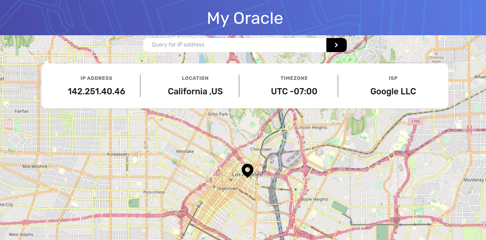

<!-- GETTING STARTED -->
## Getting Started 

The project calls the Geolocation API by IPify to get the requested IP info, then uses the result to update the outputs and map. 

Using vanilla & Tailwind CSS for styling, with regex strings for validation parsing. Styled components will used in my next project as I learn more frameworks.

Tested with Vitest & MSW API mocking

It was inspired by a front-end mentor challenge.

### Prerequisites

1. IP Geolocation API by IPify (1000 requests max)
https://geo.ipify.org/

2. LeafletJS (Generate Map)
https://leafletjs.com/
https://react-leaflet.js.org/

### Installation

1. Download zip
2. npm i to install packages & dependencies
3. npm run dev to open on localhost
4. npm run test on a seperate terminal to load vite tests

(<a href="#readme-top">back to top</a>)

## Preview

(<a href="#readme-top">back to top</a>)

<!-- CONTACT -->
## Contact

Reach out by email at hakeem0114@gmail.com

(<a href="#readme-top">back to top</a>)

